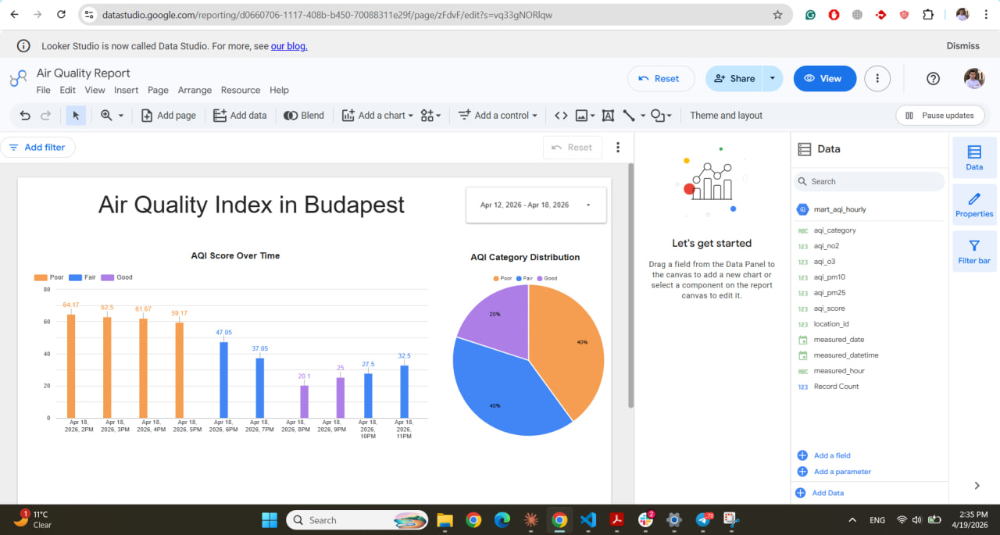
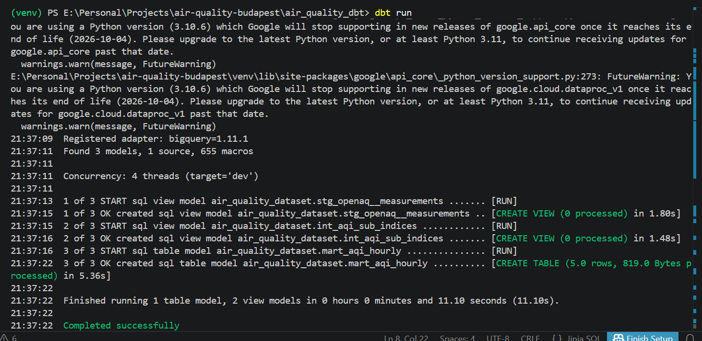

# Budapest Air Quality Pipeline

An end-to-end data engineering project that ingests real-time air quality measurements for Budapest from the [OpenAQ API](https://openaq.org/), processes them through a cloud data warehouse, and delivers an AQI dashboard in Looker Studio.

**Live Dashboard →** https://datastudio.google.com/reporting/d0660706-1117-408b-b450-70088311e29f

---

## Problem Description

Budapest regularly experiences elevated concentrations of PM2.5, NO₂, and ozone — pollutants linked to cardiovascular and respiratory disease. While raw sensor readings are publicly available through the OpenAQ API, they are not actionable on their own: they need to be aggregated, categorised against health thresholds, and presented in a way that reveals patterns over time.

This project answers three practical questions:

1. **What is the air quality right now and how has it trended?** — The pipeline ingests hourly measurements and computes a composite AQI score so a single number always reflects current conditions.
2. **How often does air quality reach unhealthy levels?** — A categorical breakdown (Good / Fair / Poor / Unhealthy / Hazardous) shows how frequently each threshold is breached.
3. **Which pollutant drives poor air quality days?** — Sub-index decomposition in the intermediate dbt layer isolates each pollutant's contribution to the overall AQI.

The result is a reproducible, cloud-native pipeline that any analyst can fork, point at a different city, and have running in under an hour.

---

## Architecture

```
OpenAQ API
    │
    ▼
Apache Airflow (Docker / GCE VM)
    │  Fetches hourly measurements, writes Parquet
    ▼
Google Cloud Storage
    │  Raw Parquet files
    ▼
BigQuery  ──────────────────────────────────────────┐
    │  air_quality_dataset.measurements              │
    ▼                                               │
dbt (staging → intermediate → mart)                 │
    │  mart_aqi_daily                               │
    ▼                                               │
Looker Studio Dashboard  ◄──────────────────────────┘
```

| Layer | Tool | Role |
|---|---|---|
| Orchestration | Apache Airflow 2 | Schedules and monitors the ingestion DAG |
| Storage (raw) | Google Cloud Storage | Parquet landing zone |
| Warehouse | BigQuery | Scalable analytical storage |
| Transformation | dbt (BigQuery adapter) | Staging → intermediate → mart models |
| Dashboard | Looker Studio | End-user visualisation |
| Infrastructure | Google Compute Engine | Hosts the Airflow Docker stack |

---

## Data Pipeline Details

### Ingestion (Airflow)

The DAG `get_airdata_openaq_dag` runs hourly. It calls the OpenAQ v2 measurements endpoint filtered to Budapest (`location_id` list), converts the JSON response to Parquet, uploads to GCS, and then loads into BigQuery using the `GCSToBigQueryOperator`.

**BigQuery table design — `measurements`**

| Design choice | Reason |
|---|---|
| Partitioned by `datetime_from` (day) | Eliminates full table scans for any time-range query |
| Clustered by `parameter` | Every downstream dbt query filters by a single pollutant (pm25, no2, o3, pm10). Clustering reduces bytes scanned by ~60–80 % on typical queries. |

### Transformation (dbt)

Three model layers follow the standard medallion pattern:

```
models/
├── staging/
│   └── stg_openaq__measurements.sql   -- view: rename & cast columns
├── intermediate/
│   └── int_aqi_sub_indices.sql        -- view: compute per-pollutant sub-indices
└── mart/
    └── mart_aqi_daily.sql             -- table: aggregate to daily AQI + category
```

**Materialisation rationale**

| Layer | Materialisation | Reason |
|---|---|---|
| staging | view | Lightweight cleanup only; no storage cost; always reflects latest raw data |
| intermediate | view | Inspectable for debugging; not queried directly by BI tools |
| mart | table | Pre-computed for fast dashboard loads; partitioned by `measurement_date`, clustered by `aqi_category` |

**`mart_aqi_daily` table design**

Partitioned by `measurement_date` — the dashboard's temporal chart always filters by date range, so partition pruning eliminates irrelevant days. Clustered by `aqi_category` — the categorical chart filters by category (Good / Fair / Poor …), which maps directly to the cluster key.

---

## Dashboard

The Looker Studio report contains two charts:

**Chart 1 — AQI Category Distribution (categorical)**
Shows how many hourly readings fell into each health category. Answers: "how often was the air unhealthy?"

**Chart 2 — AQI Score Over Time (temporal)**
Line chart of average daily AQI score with optional breakdown by category. Answers: "when were the worst periods?"



---

## Reproduce This Project

### Prerequisites

- Google Cloud account with billing enabled
- `gcloud` CLI installed locally
- Docker and Docker Compose installed (for local testing)
- Python 3.10+ with `uv` or `pip`

### 1. Clone the repository

```bash
git clone https://github.com/abdu95/air-quality-budapest.git
cd air-quality-budapest
```

### 2. Create a GCP project and service account

```bash
# Set your project ID
export PROJECT_ID=airquality-bp-dezoomcamp

gcloud projects create $PROJECT_ID
gcloud config set project $PROJECT_ID

# Enable required APIs
gcloud services enable bigquery.googleapis.com \
    storage.googleapis.com \
    compute.googleapis.com

# Create a service account and download the key
gcloud iam service-accounts create airquality-sa \
    --display-name "Air Quality SA"

gcloud projects add-iam-policy-binding $PROJECT_ID \
    --member "serviceAccount:airquality-sa@$PROJECT_ID.iam.gserviceaccount.com" \
    --role "roles/bigquery.admin"

gcloud projects add-iam-policy-binding $PROJECT_ID \
    --member "serviceAccount:airquality-sa@$PROJECT_ID.iam.gserviceaccount.com" \
    --role "roles/storage.admin"

gcloud iam service-accounts keys create gcp-key.json \
    --iam-account airquality-sa@$PROJECT_ID.iam.gserviceaccount.com
```

> `gcp-key.json` is listed in `.gitignore` — never commit it.

### 3. Create the GCS bucket and BigQuery dataset

```bash
gsutil mb -l EU gs://airquality_bp_bucket

bq --location=EU mk --dataset $PROJECT_ID:air_quality_dataset
```

### 4. Set up the VM on Google Compute Engine

```bash
gcloud compute instances create airflow-vm \
    --zone=europe-west3-a \
    --machine-type=e2-standard-2 \
    --image-family=ubuntu-2204-lts \
    --image-project=ubuntu-os-cloud \
    --boot-disk-size=20GB \
    --tags=http-server,https-server

# Open Airflow port
gcloud compute firewall-rules create allow-airflow \
    --allow tcp:8080 \
    --source-ranges 0.0.0.0/0 \
    --description "Allow Airflow UI"

# SSH into the VM
gcloud compute ssh airflow-vm --zone=europe-west3-a
```

### 5. Install Docker on the VM

```bash
sudo apt-get update
sudo apt-get install -y ca-certificates curl gnupg

curl -fsSL https://download.docker.com/linux/ubuntu/gpg | \
    sudo gpg --dearmor -o /usr/share/keyrings/docker-archive-keyring.gpg

echo "deb [arch=$(dpkg --print-architecture) \
    signed-by=/usr/share/keyrings/docker-archive-keyring.gpg] \
    https://download.docker.com/linux/ubuntu $(lsb_release -cs) stable" | \
    sudo tee /etc/apt/sources.list.d/docker.list > /dev/null

sudo apt-get update
sudo apt-get install -y docker-ce docker-ce-cli containerd.io docker-compose-plugin

sudo groupadd docker
sudo usermod -aG docker $USER
newgrp docker
```

### 6. Clone the repo on the VM and add the service account key

```bash
sudo apt-get install -y git nano
git clone https://github.com/abdu95/air-quality-budapest.git
cd air-quality-budapest

# Paste your gcp-key.json content
nano gcp-key.json
```

### 7. Configure and start Airflow

```bash
echo "AIRFLOW_UID=50000" > .env
```

Verify that `docker-compose.yaml` has the following additions under `volumes:` and `environment:` for each Airflow service:

```yaml
volumes:
  - ${AIRFLOW_PROJ_DIR:-.}/dags:/opt/airflow/dags
  - ${AIRFLOW_PROJ_DIR:-.}/logs:/opt/airflow/logs
  - ${AIRFLOW_PROJ_DIR:-.}/plugins:/opt/airflow/plugins
  - ${AIRFLOW_PROJ_DIR:-.}/data:/opt/airflow/data
  - ${AIRFLOW_PROJ_DIR:-.}/gcp-key.json:/opt/airflow/gcp-key.json

environment:
  GOOGLE_APPLICATION_CREDENTIALS: /opt/airflow/gcp-key.json
```

Then initialise and start Airflow:

```bash
docker compose up airflow-init
docker compose up -d
```

Open the Airflow UI at `http://<VM_EXTERNAL_IP>:8080` (login: `airflow` / `airflow`).

Find the external IP in the Compute Engine console next to `airflow-vm`.

### 8. Trigger the ingestion DAG

In the Airflow UI:

1. Enable the `get_airdata_openaq_dag` DAG (toggle it on).
2. Click the play button → **Trigger DAG**.
3. Wait for all tasks to turn green.

The DAG fetches measurements from the OpenAQ API, writes Parquet to GCS, and loads the data into `air_quality_dataset.measurements` in BigQuery.

### 9. Run dbt transformations

Install dbt locally (or inside the VM):

```bash
pip install dbt-bigquery
# or: uv pip install dbt-bigquery

dbt init air_quality_dbt
```

When prompted, select `bigquery`, `service-account` authentication, and provide your `gcp-key.json` path, project ID (`airquality-bp-dezoomcamp`), dataset (`air_quality_dataset`), threads (`4`), and location (`EU`).

Your `profiles.yml` should look like:

```yaml
air_quality_dbt:
  outputs:
    dev:
      type: bigquery
      method: service-account
      project: airquality-bp-dezoomcamp
      dataset: air_quality_dataset
      keyfile: /path/to/gcp-key.json
      location: EU
      threads: 4
      job_execution_timeout_seconds: 300
      job_retries: 1
  target: dev
```

Then run:

```bash
cd air_quality_dbt

dbt debug          # verify the connection
dbt deps           # install packages (dbt-utils)
dbt run            # build all models
dbt test           # run data quality tests
```

After a successful `dbt run` you will see `mart_aqi_daily` materialised as a table in BigQuery.





### 10. Open the dashboard

Go to [Looker Studio](https://lookerstudio.google.com) → **Create report** → **Add data source** → **BigQuery** → select `airquality-bp-dezoomcamp` / `air_quality_dataset` / `mart_aqi_daily`.

Or open the existing published report directly:
**https://datastudio.google.com/reporting/d0660706-1117-408b-b450-70088311e29f**

---

## Project Structure

```
air-quality-budapest/
├── dags/
│   └── get_airdata_openaq_dag.py      # Airflow ingestion DAG
├── air_quality_dbt/
│   ├── models/
│   │   ├── staging/
│   │   │   └── stg_openaq__measurements.sql
│   │   ├── intermediate/
│   │   │   └── int_aqi_sub_indices.sql
│   │   └── mart/
│   │       └── mart_aqi_daily.sql
│   ├── sources.yml
│   ├── packages.yml
│   └── dbt_project.yml
├── tests/
│   └── test_api_openaq_budapest.py
├── docker-compose.yaml
├── .env.example
├── .gitignore
└── README.md
```

---

## Technologies Used

| Tool | Version | Purpose |
|---|---|---|
| Apache Airflow | 2.x | Workflow orchestration |
| Google Cloud Storage | — | Raw data lake (Parquet) |
| Google BigQuery | — | Cloud data warehouse |
| dbt | 1.x (BigQuery adapter) | SQL transformations |
| Looker Studio | — | Dashboard & visualisation |
| Google Compute Engine | e2-standard-2 | Hosts Docker/Airflow |
| Docker / Docker Compose | — | Local containerisation |
| Python | 3.10+ | DAG logic, API client |
| OpenAQ API | v2 | Source of air quality data |

---

## Notes

- The service account key (`gcp-key.json`) is not committed to version control. Follow step 2 to generate your own.
- The OpenAQ API is free and does not require authentication for basic usage, but rate limits apply.
- Airflow is deployed with the default `LocalExecutor`. For production use, consider switching to `CeleryExecutor` or `KubernetesExecutor`.
- dbt models use `--vars` to support parameterisation by city — see `dbt_project.yml` for details.
